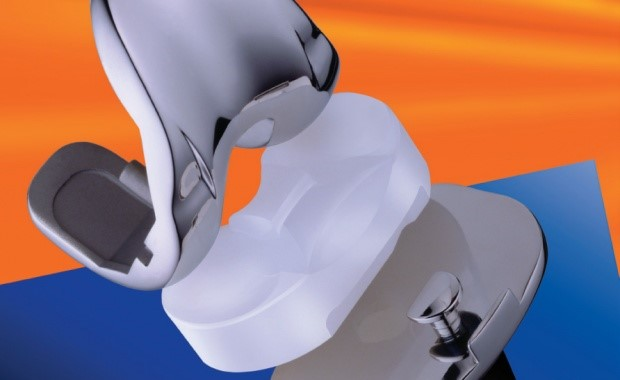
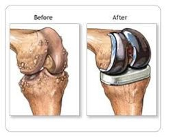
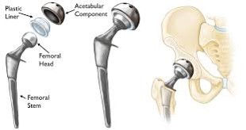
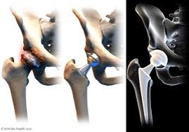

<ul>
<li>A new joint, called a prosthesis can be made of plastic, metal, or both. It may be cemented into place or not cemented, so that your bone will grow into it. Both methods may be combined to keep the new joint in place.</li>
<li>Cemented prosthesis are typically used in older adults to help fortify possible brittle bones. </li>
<li>Un-cemented prosthesis are commonly used in younger adults or adults that do not manifest brittle bones. </li>
<li>Most replaced joints are made of cobalt-chromium alloys. Theses semi metals are hard, tough, corrosion resistant, and strong enough to with stand wear and tear that are necessary for joints.</li>

</ul>